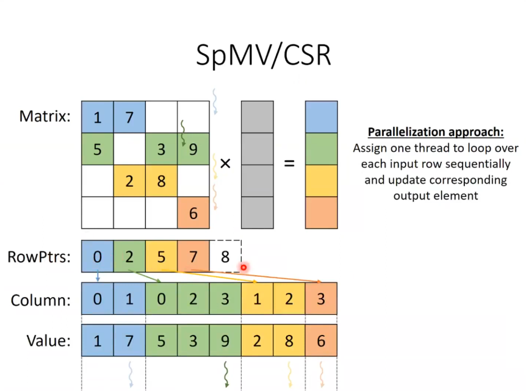

## Sparse Matrix Computation
case study: sparse matrix-vector mul (SpMV)\
Storage Formats:
- COO: coordinate format
- CSR: compressed sparsed row
- ELL: ELLPACK format
- JDS: Jagged Diagonal Storage
 
sparse matrix: majority elements are zero
(many real world systems are sparse, almost < 1% are non-zerof).
- no space allocated for zeros(save memory)
- no need to load zeros(save memory bandwidth)
- no need to compute with zeros(save compute time)

format design considerations:
- space efficiency(memory consumed)
- flexibility (ease of adding/ reordering elements)
- Accessibility (ease of finding desired data)
- memory access pattern (enable memory coalescing)
- load balance (minimize control divergence)

Choice of best format depends on the computation
- use SpMV computation as an example to study differnt formats
    - [1 Sparse Matrix]*[1 Dense Vector] = [1 Dense Vector]

## COO: coordinate format

- 1 thread per value array element.
- all our accesses are coalesced in the matrix
- not as much in the vectors.

### advantages of COO:

- adding elements is easy
- eaasy to find row and the col of the non zeroo elements(accesibility)
- therefore makes it easy to parallize 
- SpMV/COO has good coalescing for memory (memory access pattern)
- SpMC/COO no control divergence as all threads do equal work.

### disadvatnages of COO:

- removing is harder
- given a row or col, hard to find all nonzeros (need to search)
- given a non zero, easy to find row and col, easy to paralleize across non zeros.
- SpMV/COO needs atomic operations

## SpMV/CSR: compress sparsed row
to address the disadvantages of COO
- uses a rowPtrs array instead of row idx array, to indicate start of a row.
- here we can assign 1 thread per output element

### advantage CSR:
- no atomic operation
- given a row, easy to find non zeros of the row, easy to parallize across rows.
- better sync as no atomic operations
- better space efficiency

### disadvatnge CSR:
- control divergence
- memory accesses not coalesced
- adding elements is harder in csr, as all elements in the same row have to benext to each other in the col array.
- given a non zero, hard to find row; given col hard to find nonzeros

Shared memory is not very effect for SpMV has theres not much data reuse, but it can be used to improve coalescing by loading it to shared memory ina  coalesced way and locally accessing in a un coalesced way whihc will be faster as it is in shared memory.
 