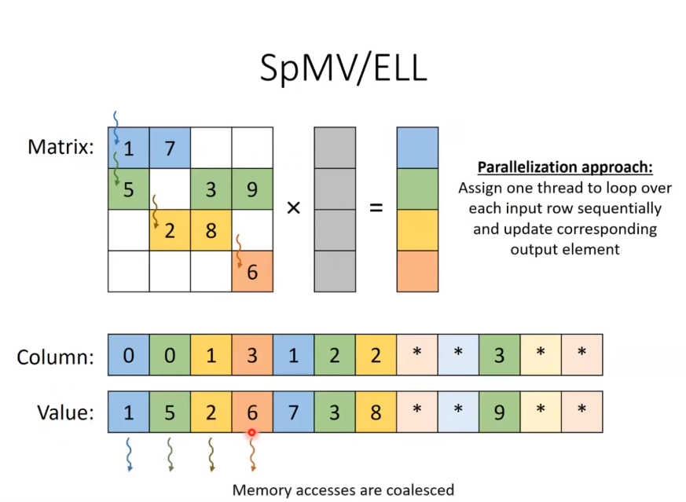
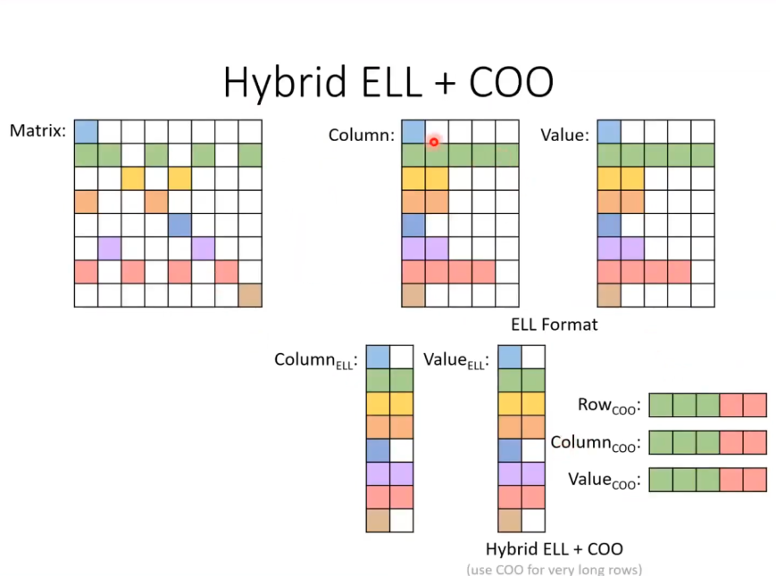
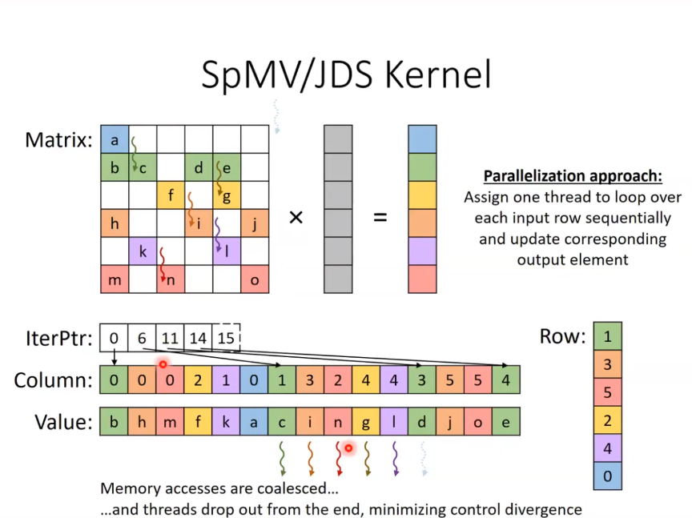

## ELL : ELLPACK format

- in SpMV/ELL memory accesses are coalesced
- no atomic operations needed
- copy time is larger 
- less space efficient coz of the padding
- flexibility is better thn CSR as its easier to add and remove elements, UNLESS its adding elements to the largest # of elements in rows.
- has same amount of control divergence as CSR
- accessibility
    - COO: given non zero eas y to find rowidx and colidx
    - CSR: given a row easy to find non zeros in the row
    - ELL: given a row easy to find non zeros, as its easy to stide across using maxNNZPerRow.
        - given a non zero its easy to find the col and row by using modulo the num of rows [i%numRows]
        - given a col we CANNOT find the non zero.
        

### Hybrid ELL +  COO 
- if 1 row has a lot more elements compared to others, padding causes lots of wastage.
- use hybrid to address this issue.

advantages:
- spce eff: more space efficiency
- flexibiliy: can add new elements to any row now, even the longest.

disadvatnge:
- control divergence

## JDS : Jagged Diagonal Storage
- to address control divergence problem in the previous formats

- we sort the rows according the num of elements in them. so threads drop out from the end so the whole warp might be dropped, minimizing control divergence.

### advantages
- space efficiency: jds is more space efficient than ELL as no padding but not aas CSR.

- flexilibitly: terrible , hard to add and remove, even harder than CSR, as it changes the order of sorting in rows
- accessibilty: - slightly worse than CSR, when given a row to find the non zero
                - give non zero we can find col idx, but row idx is a bit harder
                - given col idx cannot find anything.
- coalescing: good, rows are sorted, even better than ELL.
- control divergence is also good.
