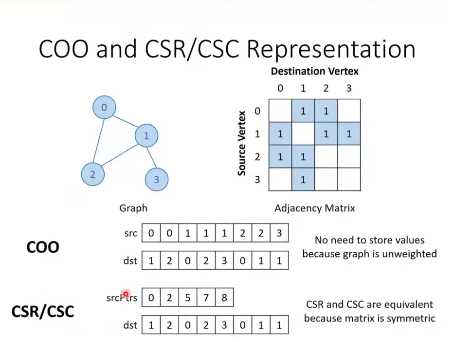

## Graph Processing 1

### Representing Graphs
graphs represented as adjecency matrices.\
    - we can use same storage format as sparse matrices.

we are working with unwieghted and undirected graphs
    - non zeros are all ones
    - matrices are symmetric (CSR/CSC are equivalent)

### approaches to parallelize
- vertex-centric: 1 thread per vertex
    - typucally CSR/CSC, as given row easy to find non zero values, here given vertex easy to fina l its neighbours.
    - can use ELL and JDS as optimizations

- edge centric: 1 thread per edge
    - typically COO, as given non zero easy to find row and col idxs
    - given an dege, easy to find its source and destination vertices.

 - Hybrid:
    - ex: given a edge, find neigbours of the source vertices and neighbuors of the destination vertices.
    - uses both COO and CSR
    - application: Triangle counting, k-clique decomposition
 
### BFS breadth-first-search
- Vertix center has 2 approaches
    - top-down