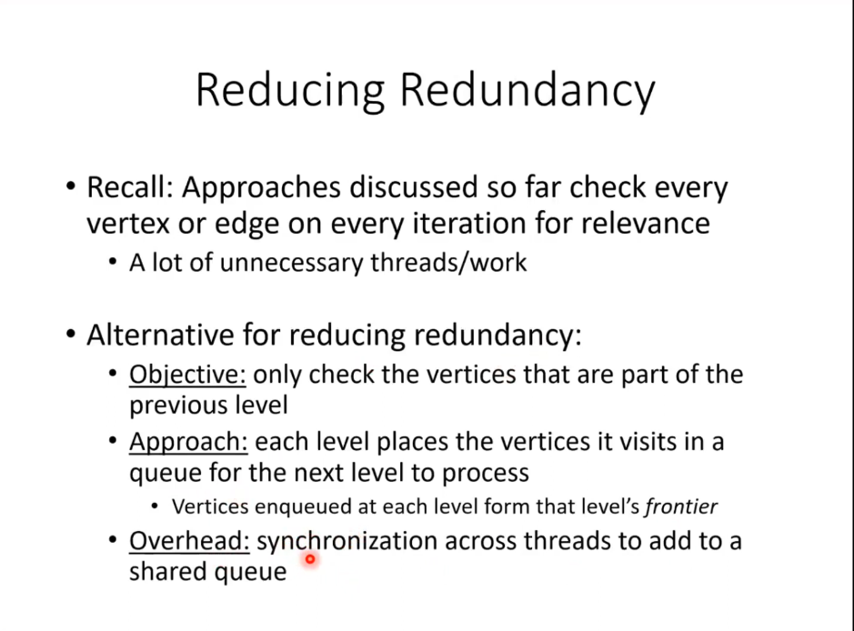
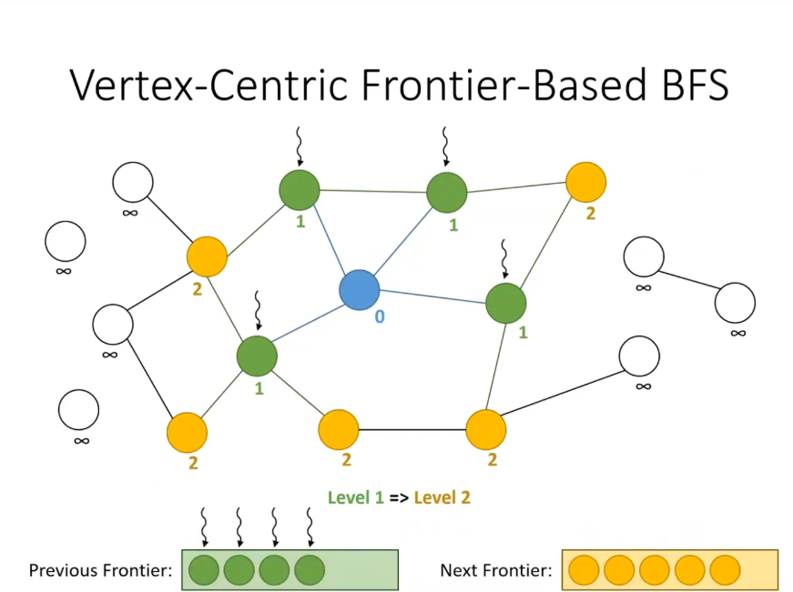
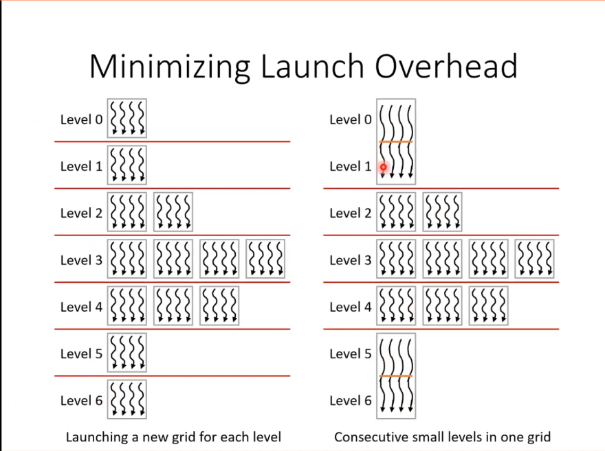

## Graph Processing
- to address redundant work
### Frontier based approach using queues.

### vertex-centric frontier based BFS 

- we use `compare and swap` atomic operations `atomicCAS()`
- significantly faster as we have no redundency

## problems
- multiple threads are still in contention 
- as all threads are atomically incrementing to the same global ccounter to insert into the queue.
- we have hihg latency die to global mem access and serialization due to high contention.

### solution to contention between threads: Privatization
- have private queues 
- each thread block maintains a private queue and commits entries to global queue on completion.

gain from privitization wasnt that huge.

### minimizing launch overhead 
- so far, we launch a new grid for each level,
- we also need to sync btw every lvl using the buffers

Optimization:
- if consecutuve lvls have few enough vertices that can be exec by one thred block:
    - exec multi elvels in a single block grid and sync between lvls using __syncthreads();
    - reduces total no of grid launches
    

