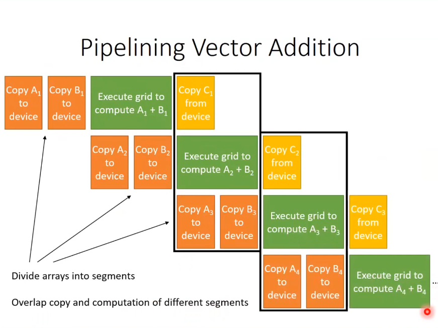
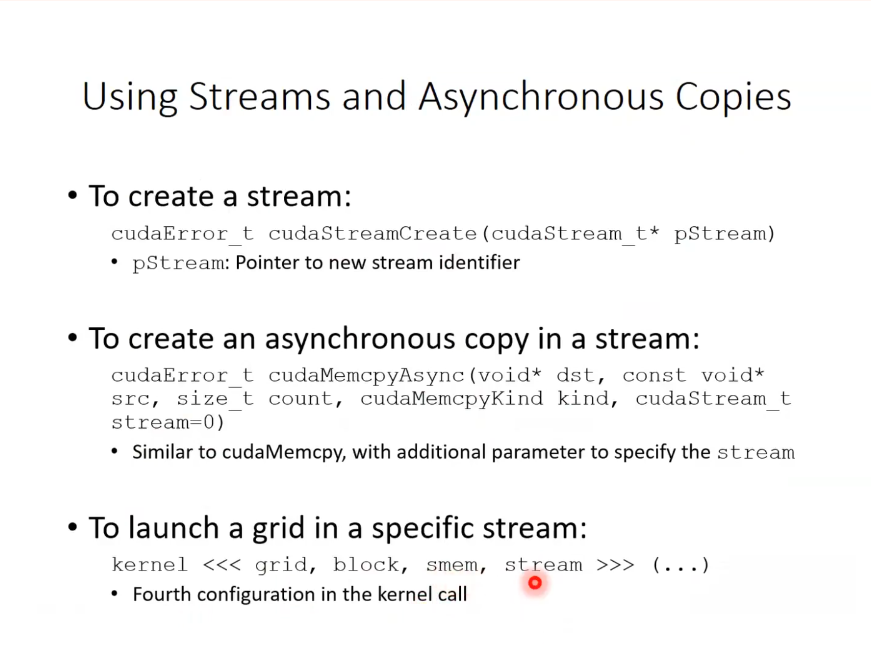

## Pin memory
ex: in vector addition
- were gonna be focusing on copy time.

```sh
(cuda) ➜  21_pinMem_streams git:(main) ✗ ./vecadd 
CPU time: 158.822998 ms
Allocation time: 0.608000 ms
Copy to GPU time: 46.280000 ms
Kernel time: 1.735000 ms
Copy to CPU time: 24.041001 ms
Deallocation time: 0.593000 ms
GPU time: 73.326997 ms
```

- Total GPU time was dominated by the copy time itself. how can we optimize this?

Direct Memory Access happens during cudaMemcpy() that copies data from Main mem(CPU) -> Global Mem(GPU)

advantage of DMA
- cpu can be utilizaed for other things while themmeory copy is taking place
- lower latency
- CPU doesnt have access to the GPU memory through the pcie bus, therefore use DMA

disadvantage of DMA
- CPU uses virtual address
- handware & software than does address translation in on the CPU.
- DMA Engine uses physical Address
- DMA engine cannot do address translation
- cannot use Page tables etc, therefore uses physical address
- Drawbacks of using DMA using physical address
    - if DMA is reading from something  u cannot move that thing around
    - if memory in the DMA gets swapped out the DMA cannot detect that.
    - in CPU if t gets swapped out, well get a page fault and we can just swap it back in.
    - with DMA the physical page may get swapped by the OS. which may lead it to read the wrong data.

- Solution: if we dont want the DMA to read the wrong data:
- we lock the memory address, to make sure memory doesnt get swapped by the OS
- we allocate it as pinned (or page-locked) memory.

In cudaMemcpy()
- host to device:
    - CPU copies data to a pinned memory buffer(on CPU)
    - DMA copies data from the pinned memory biffer to the device
- device to host
    - DMA copies data from the device to a pinned memory biffer.
    - CPU copies data from the pinned memory buffer

Therefore, every cudaMemcpy is actually two copies, which incurs overhead.

### optimization

[text](readme.md)

- we also improve CPU time as we dont get any page faults as memory is pinned.


## Parallelism in System Architecture Level -> Task parallelism - using Streams

- a typical system is simulataneiously capableof:
    - exec grids on the GPU
    - copying from host to device
    - copying from device to host
- all are done by 3 different hardware resources.

### Pipelining vector addition



- multiple grids can run on the GPU in parallel.

### Streams and Asynchronous copies
- parllelism btw mutliple grids and memory copies can be acheived using streams.
    - tasks in different streams are exec in parallel
    - taks in the same streams are seriallized
    - if no stream is specified , tasks go nto default sstream.

To over memory copies with the host execution asynchronous memory copies are usedd. cudamemcpy is not async.
    - allows host to proceed without waiting for copy to finish so that it can enqueue tasks in other streams.

    

cudaEvents can be used to see how long a particular operation in a particular stream took.


